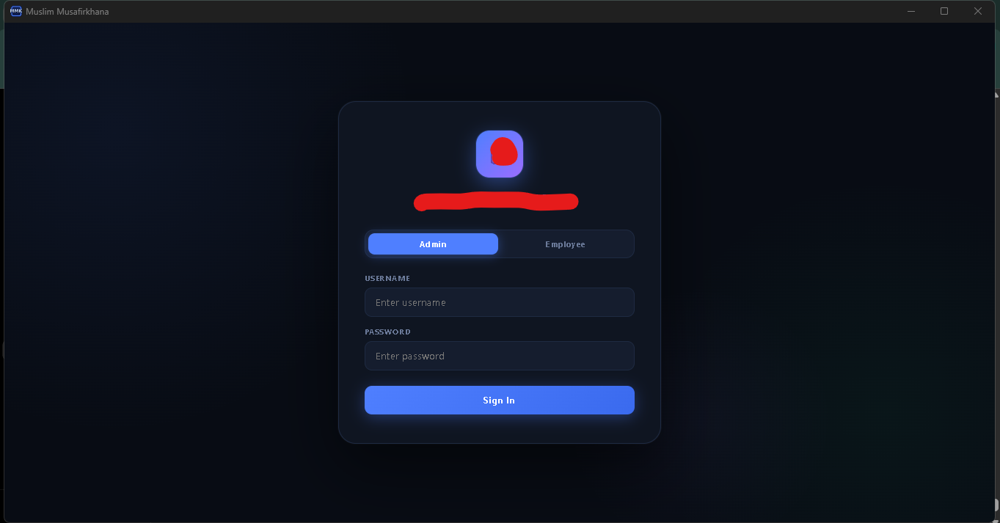
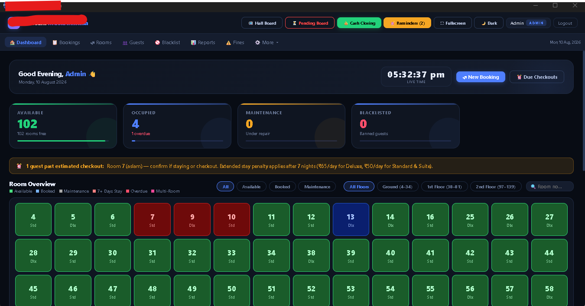
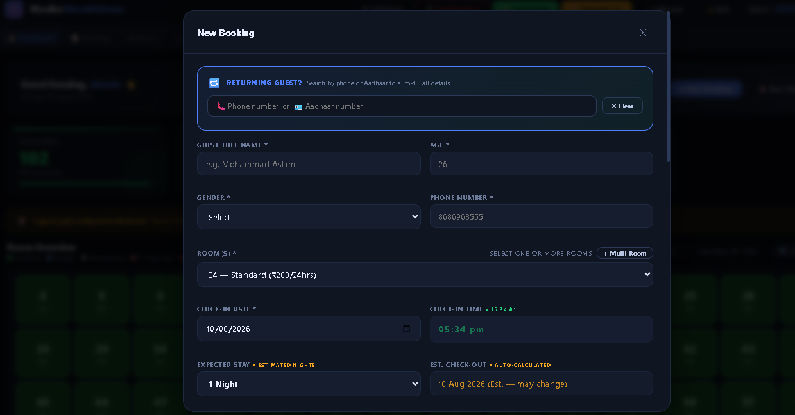
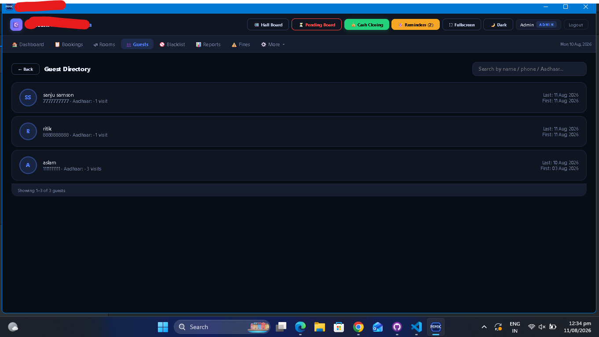
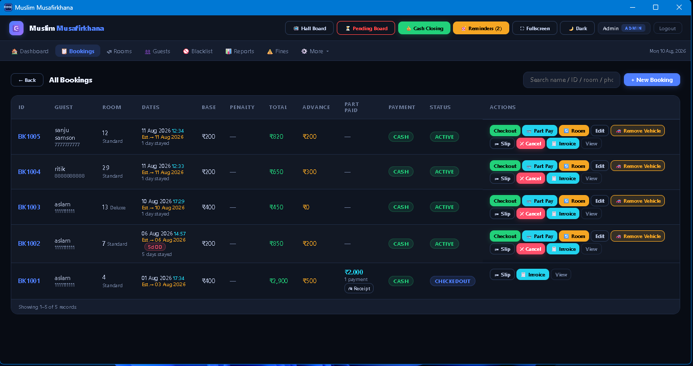
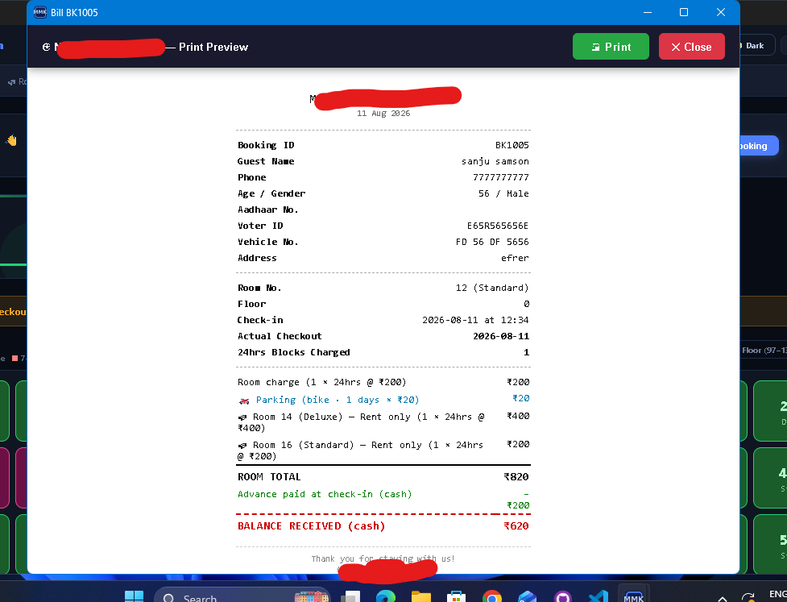
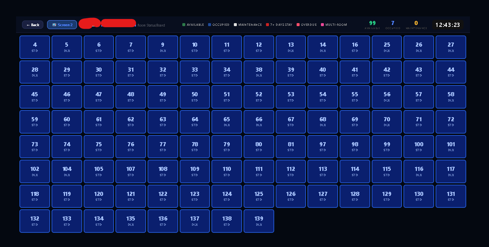
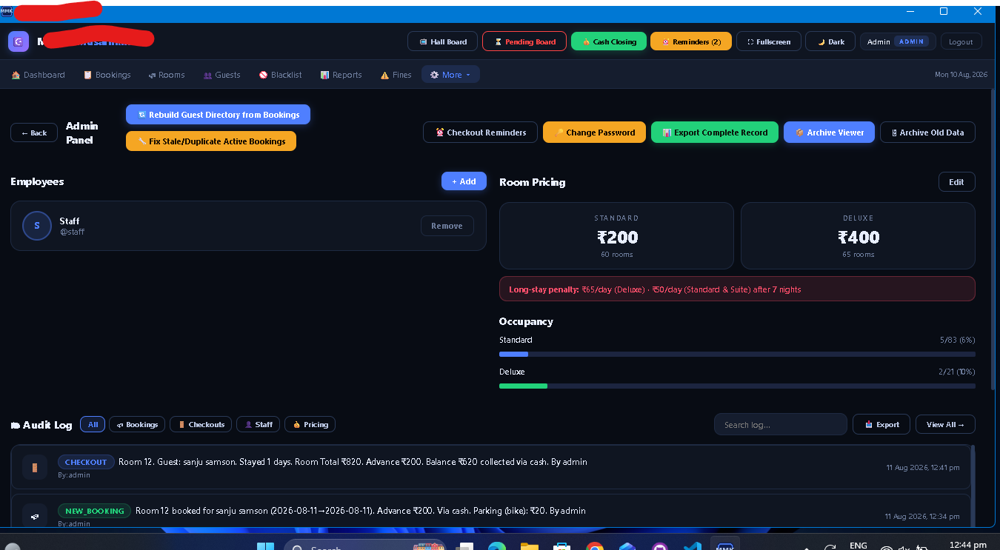
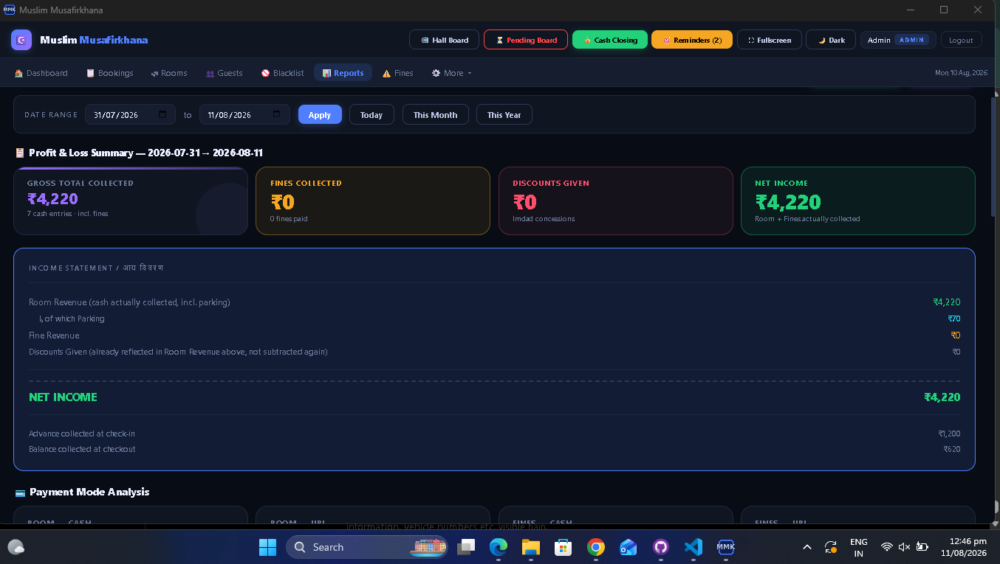

# MMK HMS

<p align="center">
  <strong>Enterprise Offline Hotel Management System</strong>
</p>

<p align="center">
  
  
  
  
  
</p>

## Enterprise Offline Hotel Management System

MMK HMS is an offline-first hotel management system designed to manage hotel rooms, bookings, guests, billing, payments, reports, and daily hotel operations from a centralized desktop application.

The system is designed for hotel staff and administrators who need fast room management, guest tracking, booking operations, checkout billing, and operational reporting without depending on an online booking platform.

---

## 🚀 Key Features

- 🔐 Admin and Employee login
- 🏨 Room availability and status management
- 📅 Guest booking management
- 👤 Guest directory and guest history
- 🔎 Guest search using name, phone, or Aadhaar
- 🛏️ Multi-room booking support
- 💰 Advance and partial payment management
- 🧾 Booking confirmation and bill printing
- 💳 Checkout and final billing
- 🚗 Vehicle parking management
- 📊 Reports and income analytics
- ⚠️ Fine and penalty management
- 🚫 Guest blacklist management
- 🏷️ Discount management
- 📋 Daily operational records
- 📤 Excel export
- 🖨️ Printable hotel documents
- 🕐 Time-based room billing
- 📝 Audit and shift management
- 🌙 Dark mode interface
- 🖥️ Fullscreen desktop interface
- 💾 Offline-first data management

---

## 🖥️ Application Screenshots  The following screenshots demonstrate the main workflows and interface of MMK HMS.  ### 1. 🔐 Login  Secure login interface with separate administrator and employee access.    ---  ### 2. 📊 Dashboard  The dashboard provides an overview of hotel operations, room availability, occupancy, maintenance status, and quick operational actions.    ---  ### 3. 📅 New Booking  The booking module allows staff to create reservations, enter guest information, select rooms, manage check-in details, and record advance payments.    ---  ### 4. 👤 Guest Directory  Centralized guest records can be searched and reviewed by hotel staff.    ---  ### 5. 🧾 Booking Confirmation  The confirmation screen provides booking and payment information that can be reviewed and printed.    ---  ### 6. 💳 Checkout & Billing  The checkout module handles final billing, payments, discounts, parking charges, and outstanding balances.    ---  ### 7. 🛏️ Room Status Board  A visual room board provides a quick overview of room availability and current room status.    ---  ### 8. ⚙️ Administration  Administrative tools provide access to system-level operations and management functions.    ---  ### 9. 📈 Reports & Analytics  The reporting interface provides financial and operational information for hotel management.  

### 1. Login


Secure login interface with separate administrator and employee access.

### 2. Dashboard


The dashboard provides an overview of available rooms, occupied rooms, maintenance rooms, blacklisted guests, room status, and quick operational actions.

### 3. New Booking


The booking module allows staff to create reservations with guest information, room selection, check-in details, expected stay, and advance payment.

### 4. Guest Directory


Guest records can be searched and reviewed from a centralized guest directory.

### 5. Booking Confirmation


The booking confirmation screen provides booking, guest, room, stay, and payment information that can be printed for the customer.

### 6. Checkout & Billing


The checkout module calculates final room charges, payments, discounts, parking charges, and outstanding balance.

### 7. Room Status Board


The visual room board provides a quick overview of room availability and room status across the property.

### 8. Administration


Administrative tools provide access to administration, audit logs, and shift management.

### 9. Reports & Analytics


The reporting module provides financial and operational information including gross collection, net income, fines, discounts, room revenue, parking revenue, advance payments, and checkout collections.

---
---

## 🎥 Demo

MMK HMS is demonstrated through the application screenshots included in this repository.

The screenshots cover the primary hotel workflows:

- 🔐 Authentication
- 📊 Dashboard
- 📅 Booking
- 👤 Guest management
- 🧾 Booking confirmation
- 💳 Checkout and billing
- 🛏️ Room status
- ⚙️ Administration
- 📈 Reports and analytics

> Production customer information has been anonymized or removed from the publicly shared screenshots.

---

## 📚 Documentation

Technical and project documentation is available in the [`docs/`](docs/) directory.

### Documentation Areas

- 🏗️ Application architecture
- 📋 Functional modules
- 🖥️ User interface documentation
- 📊 Reporting workflows
- 🔐 Data privacy considerations
- 🛠️ Development notes

### Project Resources

| Resource | Location |
|---|---|
| Screenshots | [`screenshots/`](screenshots/) |
| Documentation | [`docs/`](docs/) |
| Architecture | [`docs/`](docs/) |
| Project README | [`README.md`](README.md) |

---

## 🚀 Project Status

**Status:** Portfolio / Documentation Version

The repository contains the public-facing documentation, interface screenshots, architecture information, and selected project resources for MMK HMS.

Production-specific configuration, credentials, private customer information, and proprietary implementation details are intentionally excluded.

---

## 📌 Important

MMK HMS is an **offline-first desktop hotel management system** designed around local hotel operations.

The public repository is intended to demonstrate the project's:

- Architecture
- Functionality
- User interface
- Technical stack
- Software development approach

It is **not intended to contain production customer data or confidential deployment configuration**.

## 🧩 Core Modules

### Authentication

Role-based access for administrators and employees.

### Room Management

Manage room availability, occupancy, maintenance status, room types, and room pricing.

### Booking Management

Create and manage guest bookings with room allocation and stay information.

### Guest Management

Maintain guest records and retrieve previous guest information.

### Billing & Checkout

Calculate stay charges, payments, discounts, parking charges, and final balances.

### Payment Management

Support advance payments and mid-stay/partial payments.

### Reports

Generate operational and financial reports for selected date ranges.

### Administration

Manage administrative functions, audit records, and shift-related operations.

---

## ⚙️ Technology Stack

| Technology | Purpose |
|---|---|
| Angular | Frontend application |
| Electron.js | Desktop application |
| Node.js | Backend/runtime services |
| SQLite | Local database |
| TypeScript | Application development |
| HTML/CSS | User interface |

---

## 🏗️ Application Architecture

MMK HMS follows an offline-first desktop application architecture.

```text
User
 │
 ▼
┌─────────────────────────────┐
│          Angular            │
│       Frontend / UI         │
└──────────────┬──────────────┘
               │
               ▼
┌─────────────────────────────┐
│          Electron           │
│       Desktop Runtime       │
└──────────────┬──────────────┘
               │
               ▼
┌─────────────────────────────┐
│          Node.js            │
│     Application Services    │
└──────────────┬──────────────┘
               │
               ▼
┌─────────────────────────────┐
│           SQLite            │
│       Local Database        │
└─────────────────────────────┘
Architecture Overview
Angular — Provides the application interface and frontend workflows.
Electron.js — Packages and runs the application as a desktop application.
Node.js — Handles application-level services and local operations.
SQLite — Provides local database storage for hotel management data.

The architecture is designed to keep the core hotel management workflow available locally without depending on an online booking service.

💡 Why Offline-First?

MMK HMS is designed around local hotel operations.

The application keeps core hotel management functionality available without requiring an internet connection for normal day-to-day operations.

This approach can be useful for:

Hotels with unreliable internet
Local hotel operations
Faster local data access
Reduced dependency on cloud services
Desktop-based hotel management
📂 Project Structure
mmk-hms/
│
├── assets/
├── demo/
├── diagrams/
├── docs/
│
├── screenshots/
│   ├── 01-login.png
│   ├── 02-dashboard.png
│   ├── 03-booking.png
│   ├── 04-guests.png
│   ├── 05-confirmation.png
│   ├── 06-checkout.png
│   ├── 07-room-board.png
│   ├── 08-admin-menu.png
│   └── 09-reports.png
│
├── .gitattributes
└── README.md
📊 Reporting

The reporting system is designed to provide management with a consolidated view of hotel revenue and operations.

Example reporting information includes:

Room revenue
Parking revenue
Fine revenue
Discounts
Advance collections
Checkout collections
Net income
🔒 Data Privacy

Screenshots included in this repository are prepared for portfolio/demo purposes.

Sensitive guest information has been removed or anonymized from publicly shared screenshots.

The repository should not contain production customer data, credentials, authentication tokens, database files containing real guest information, or other private operational information.

🎯 Project Goals

MMK HMS was developed to provide a practical desktop-based solution for hotel front-desk and administrative operations.

The primary goals are:

Simplify hotel room management
Reduce manual booking work
Centralize guest information
Improve checkout and billing workflows
Provide useful financial reporting
Support offline hotel operations
Provide a simple interface for hotel employees
🛣️ Future Improvements

Potential future improvements include:

Automated database backup and restore
Advanced role and permission management
Improved audit reporting
Automated report generation
Additional dashboard analytics
Improved data import/export
Automated application updates
Enhanced deployment and installation workflow
👨‍💻 Developer

Mohammad Aslam

Frontend / Desktop Application Developer

Project

MMK HMS — Enterprise Offline Hotel Management System

📌 Portfolio Note

This repository presents the architecture, functionality, interface, and documentation of MMK HMS as a software portfolio project.

Production-specific configuration, credentials, private customer data, and proprietary implementation details are intentionally excluded from the public repository.
